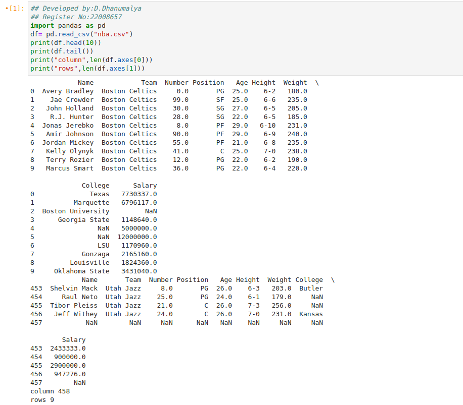

# Read-from-CSV

## AIM:

To write a python program for reading the csv file content.

## EQUIPEMENT REQUIRED:

PC Anaconda - Python 3.7

## ALGORITHM:

### Step 1:
Load the CSV into a DataFrame.

### Step 2:
Print the number of contents to be displayed using df.head().

### Step 3:
The number of rows returned is defined in Pandas option settings.

### Step 4:
Check your system's maximum column with the pd.options.display.max_column statement.

### Step 5:
Increase the maximum number of rows to display the entire DataFrame.

## PROGRAM:
```
## Developed by:D.Dhanumalya.
## Reference No:22008657
with open('python.py','r') as file1:
    with open('text.txt','w') as file2:
        for line in file1:
            file2.write(line)

```

## OUTPUT:


## RESULT:
Thus the program is written to read the csv file.